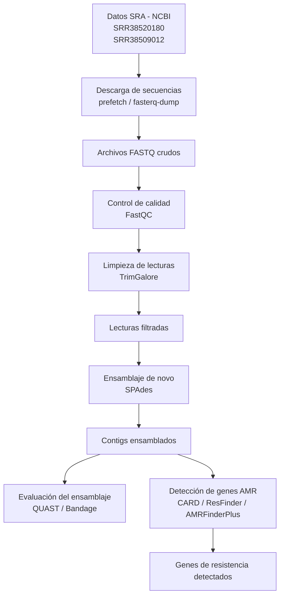

# MBM_G1  
# Proyecto: Identificación de genes de resistencia antimicriobiana de diferentes aislados clínicos de Pseudomonas aeruginosa    
## Integrantes  
- José Proaño  
- Génesis Morocho  
- Mayra Erazo 
- Samanta Bucheli  
- Michelle Yugcha
## Pregunta de investigación
¿Qué genes de resistencia antimicrobiana pueden identificarse mediante el ensamblaje y análisis bioinformático de diferentes aislados clínicos de Pseudomonas aeruginosa? 
  
## Objetivos  
### Objetivo general  
Identificar genes de resistencia antimicrobiana y secuencias plasmídicas presentes en diferentes aislados clínicos de Pseudomonas aeruginosa mediante ensamblaje de novo y análisis bioinformático.
### Objetivos específicos
•  Realizar el control de calidad de las lecturas genómicas obtenidas de diferentes aislados clínicos de Pseudomonas aeruginosa.   
•  Ensamblar los genomas bacterianos utilizando herramientas de ensamblaje de novo.   
•  Detectar genes de resistencia antimicrobiana utilizando bases de datos específicas.    
•  Comparar los perfiles de resistencia antimicrobiana entre los diferentes aislados clínicos analizados.  
## Dataset  
Las secuencias fueron obtenidas desde la base de datos pública Sequence Read Archive (SRA) del National Center for Biotechnology Information (NCBI), la cual almacena datasets de secuenciación genómica generados en investigaciones científicas.  
Se utilizarán secuencias genómicas en formato FASTQ de dos diferentes aislados clínicos de Pseudomonas aeruginosa provenientes de secuenciación de lecturas largas mediante tecnología illumina, este tipo de datos permite trabajar con lecturas reales o en crudo de secuenciación genómica.   
Las secuencias de trabajo fueron las siguientes:     
1.	Pseudomonas aeruginosa: Illumina sequencing of 2026CB-00371 (SRR38520180)    
Tamaño: 151.8MB  
Contenido de GC: 65.8%   
Fecha de publicación: 026-05-12    
  
2.	Pseudomonas aeruginosa genomic sequencing of bacterial isolate 2026CH_00024 (SRR38509012)  
Tamaño: 94.5MB  
Contenido de GC: 66%  
Fecha de publicación: 2026-05-11  
 ## Metodología de Ensamblaje
El ensamblaje de los genomas se realizó utilizando la herramienta **SPAdes** (`spades.py`). El proceso se dividió en los siguientes pasos:

1. **Preprocesamiento:** Las secuencias fueron descargadas (utilizando `prefetch` y `fasterq-dump`) y se realizó un control de calidad y limpieza de adaptadores mediante **Trim Galore**.
2. **Limpieza de lecturas:** Se ejecutó el recorte de adaptadores (`-a "file:./my_adapters.fa"`) con parámetros de calidad (`--quality 30`) y longitud mínima (`--length 30`).
3. **Ensamblaje De Novo:** Se utilizó el comando `spades.py` con las lecturas limpias (`_val_1.fq.gz` y `_val_2.fq.gz`), configurando 8 hilos de procesamiento (`-t 8`) y una memoria de 15 GB (`-m 15`).
4. **Evaluación:** Se utilizó **BUSCO** (`busco -m genome`) para evaluar la calidad del ensamblaje obtenido en los archivos `contigs.fasta`.

## Flujo de trabajo
El flujo de trabajo bioinformático del proyecto describe de manera secuencial las etapas utilizadas para identificar genes de resistencia antimicrobiana en aislados clínicos de Pseudomonas aeruginosa a partir de datos de secuenciación genómica obtenidos desde bases públicas.

1. Obtención de datos desde SRA (NCBI)

El análisis inicia con la búsqueda y descarga de secuencias genómicas almacenadas en la base de datos pública Sequence Read Archive (SRA) del NCBI.

Los aislados seleccionados fueron:

SRR38520180
SRR38509012

Estas secuencias corresponden a lecturas Illumina en formato FASTQ.

2. Descarga de secuencias

Para descargar los datos se utilizó la herramienta prefetch, la cual permite obtener los archivos de secuenciación desde NCBI de manera eficiente.

Posteriormente, los datos descargados fueron convertidos al formato FASTQ para su procesamiento bioinformático.

Resultado:

Archivos FASTQ crudos.
3. Control de calidad (FastQC)

Los archivos FASTQ obtenidos fueron analizados mediante la herramienta FastQC con el objetivo de evaluar la calidad de las lecturas genómicas.

En esta etapa se analizaron parámetros como:

calidad de bases (Phred score),
contenido GC,
presencia de adaptadores,
longitud de lecturas,
posibles errores de secuenciación.

Resultado:

Reportes de calidad en formato HTML.
4. Limpieza de lecturas (TrimGalore)

Posteriormente, las lecturas fueron procesadas con TrimGalore para eliminar adaptadores y regiones de baja calidad que podrían afectar el ensamblaje genómico.

Además, se filtraron lecturas demasiado cortas o con baja confiabilidad.

Resultado:

Lecturas filtradas y limpias listas para ensamblaje.
5. Ensamblaje de novo (SPAdes)

Las lecturas filtradas fueron ensambladas mediante la herramienta SPAdes utilizando un enfoque de ensamblaje de novo.

Este proceso permite reconstruir fragmentos del genoma bacteriano sin utilizar un genoma de referencia.

Resultado:

Contigs ensamblados del genoma de Pseudomonas aeruginosa.
6. Evaluación del ensamblaje (QUAST)

Los contigs obtenidos fueron evaluados utilizando QUAST para determinar la calidad del ensamblaje generado.

Se analizaron métricas como:

número de contigs,
longitud total,
N50,
continuidad del ensamblaje.

Resultado:

Reporte de calidad del ensamblaje.
7. Detección de genes de resistencia antimicrobiana

Finalmente, los contigs ensamblados fueron analizados utilizando bases de datos y herramientas especializadas como CARD y ResFinder para identificar genes asociados a resistencia antimicrobiana.

Esta etapa permitió detectar genes relacionados con resistencia a diferentes familias de antibióticos presentes en los aislados clínicos analizados.

Resultado:

Identificación de genes de resistencia antimicrobiana

## Resultados  
## Contribución individual  
Resumen breve  
## Cómo reproducir (scripts)

## Tutorial de Galaxy
Willem de Koning, Saskia Hiltemann, Detección de resistencia a antibióticos (Materiales de capacitación de Galaxy) . https://training.galaxyproject.org/training-material/topics/microbiome/tutorials/plasmid-metagenomics-nanopore/tutorial.html En línea; consultado el miércoles 13 de mayo de 2026.
