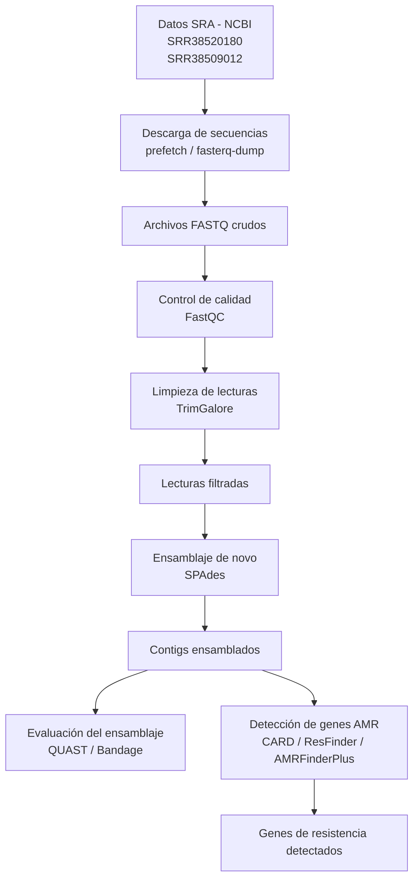

# MBM_G1  
# Proyecto: Identificación de genes de resistencia antimicriobiana de aislados clínicos de Pseudomonas aeruginosa    
## Integrantes  
- José Proaño  
- Génesis Morocho  
- Mayra Erazo 
- Samanta Bucheli  
- Michelle Yugcha
## Pregunta de investigación
¿Qué genes de resistencia antimicrobiana pueden identificarse mediante el ensamblaje y análisis bioinformático de diferentes aislados clínicos de Pseudomonas aeruginosa? 
  
## Objetivos  
### Objetivo general  
Identificar genes de resistencia antimicrobiana y secuencias plasmídicas presentes en diferentes aislados clínicos de Pseudomonas aeruginosa mediante ensamblaje de novo y análisis bioinformático.
### Objetivos específicos
•  Realizar el control de calidad de las lecturas genómicas obtenidas de diferentes aislados clínicos de Pseudomonas aeruginosa.   
•  Ensamblar los genomas bacterianos utilizando herramientas de ensamblaje de novo.   
•  Detectar genes de resistencia antimicrobiana utilizando bases de datos específicas.    
•  Comparar los perfiles de resistencia antimicrobiana entre los diferentes aislados clínicos analizados.  
## Dataset  
Las secuencias fueron obtenidas desde la base de datos pública Sequence Read Archive (SRA) del National Center for Biotechnology Information (NCBI), la cual almacena datasets de secuenciación genómica generados en investigaciones científicas.  
Se utilizarán secuencias genómicas en formato FASTQ de dos diferentes aislados clínicos de Pseudomonas aeruginosa provenientes de secuenciación de lecturas largas mediante tecnología illumina, este tipo de datos permite trabajar con lecturas reales o en crudo de secuenciación genómica.   
Las secuencias de trabajo fueron las siguientes:     
1.	Pseudomonas aeruginosa: Illumina sequencing of 2026CB-00371 (SRR38520180)    
Tamaño: 490.6 Mb   
Contenido de GC: 65.8%   
Fecha de publicación: 12-05-2026   
Procedencia: Texas Department of State Health Services, Estados Unidos      
  
2.	Pseudomonas aeruginosa genomic sequencing of bacterial isolate 2026CH_00024 (SRR38509012)  
Tamaño: 332.9 Mb   
Contenido de GC: 66%   
Fecha de publicación: 11-05-2026   
Procedencia: Wyoming Public Health Laboratory, Estados Unidos  

 ## Metodología 
El ensamblaje de los genomas se realizó utilizando la herramienta **SPAdes** (`spades.py`). El proceso se dividió en los siguientes pasos:

1. **Preprocesamiento:** Las secuencias fueron descargadas (utilizando `prefetch` y `fasterq-dump`) y se realizó un control de calidad y limpieza de adaptadores mediante **Trim Galore**.
2. **Limpieza de lecturas:** Se ejecutó el recorte de adaptadores (`-a "file:./my_adapters.fa"`) con parámetros de calidad (`--quality 30`) y longitud mínima (`--length 30`).
3. **Ensamblaje De Novo:** Se utilizó el comando `spades.py` con las lecturas limpias (`_val_1.fq.gz` y `_val_2.fq.gz`), configurando 8 hilos de procesamiento (`-t 8`) y una memoria de 15 GB (`-m 15`).
4. **Evaluación:** Se utilizó **BUSCO** (`busco -m genome`) para evaluar la calidad del ensamblaje obtenido en los archivos `contigs.fasta`.

## Herramientas bioinformáticas empleadas

1. SRA Toolkit: descarga de secuencias crudas a partir de CNBI.

2. FastQC: revisión de calidad de lecturas

3. Trim Galore: permite la limpieza de los datos crudos

4. SPAdes: formación de conting

5. BUSCO: validación de la secuencia

6. CARD: identificación de genes de resistencia

## Flujo de trabajo

El workflow bioinformático inició con la descarga de secuencias genómicas desde la base de datos SRA del NCBI correspondientes a los aislados clínicos SRR38520180 y SRR38509012.  

Posteriormente, se realizó el control de calidad de las lecturas utilizando FastQC y la limpieza de adaptadores y lecturas de baja calidad mediante TrimGalore.  

Las lecturas filtradas fueron ensambladas de novo con SPAdes para obtener contigs genómicos, los cuales fueron evaluados mediante QUAST.  

Finalmente, se identificaron genes de resistencia antimicrobiana utilizando herramientas y bases de datos especializadas como CARD y ResFinder.

Diagrama 1. FLujo de trabajo bioinformático

## Resultados  

## Conclusiones

Se estableció un diagrama de flujo junto con la validación otorgada por BUSCO, se estableció un metodología factible para la identificación de genes de resistencia antimicrobiana.

Se reconstruyó genomas baterianos por medio de librerias SRR38520180 y SRR38509012 arrojando contigs.

## Contribución individual  
Resumen breve  
## Cómo reproducir (scripts)

## Tutorial de Galaxy
Willem de Koning, Saskia Hiltemann, Detección de resistencia a antibióticos (Materiales de capacitación de Galaxy) . https://training.galaxyproject.org/training-material/topics/microbiome/tutorials/plasmid-metagenomics-nanopore/tutorial.html En línea; consultado el miércoles 13 de mayo de 2026.
