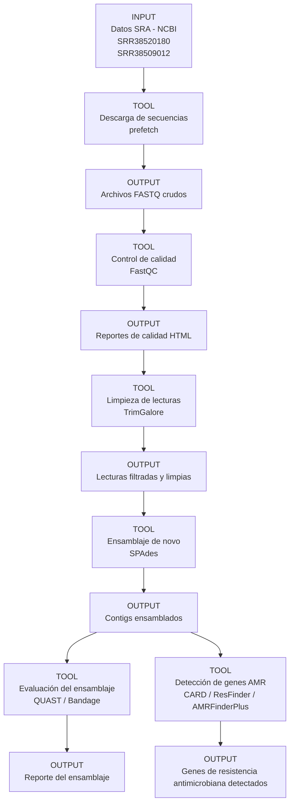

# MBM_G1  
# Proyecto: Identificación de genes de resistencia antimicriobiana de diferentes aislados clínicos de Pseudomonas aeruginosa    
## Integrantes  
- José Proaño  
- Génesis Morocho  
- Mayra Erazo 
- Samanta Bucheli  
- Michelle Yugcha
## Pregunta de investigación
¿Qué genes de resistencia antimicrobiana pueden identificarse mediante el ensamblaje y análisis bioinformático de diferentes aislados clínicos de Pseudomonas aeruginosa? 
  
## Objetivos  
### Objetivo general  
Identificar genes de resistencia antimicrobiana y secuencias plasmídicas presentes en diferentes aislados clínicos de Pseudomonas aeruginosa mediante ensamblaje de novo y análisis bioinformático.
### Objetivos específicos
•  Realizar el control de calidad de las lecturas genómicas obtenidas de diferentes aislados clínicos de Pseudomonas aeruginosa.   
•  Ensamblar los genomas bacterianos utilizando herramientas de ensamblaje de novo.   
•  Detectar genes de resistencia antimicrobiana utilizando bases de datos específicas.    
•  Comparar los perfiles de resistencia antimicrobiana entre los diferentes aislados clínicos analizados.  
## Dataset  
Las secuencias fueron obtenidas desde la base de datos pública Sequence Read Archive (SRA) del National Center for Biotechnology Information (NCBI), la cual almacena datasets de secuenciación genómica generados en investigaciones científicas.  
Se utilizarán secuencias genómicas en formato FASTQ de dos diferentes aislados clínicos de Pseudomonas aeruginosa provenientes de secuenciación de lecturas largas mediante tecnología illumina, este tipo de datos permite trabajar con lecturas reales o en crudo de secuenciación genómica.   
Las secuencias de trabajo fueron las siguientes:     
1.	Pseudomonas aeruginosa: Illumina sequencing of 2026CB-00371 (SRR38520180)    
Tamaño: 151.8MB  
Contenido de GC: 65.8%   
Fecha de publicación: 026-05-12    
  
2.	Pseudomonas aeruginosa genomic sequencing of bacterial isolate 2026CH_00024 (SRR38509012)  
Tamaño: 94.5MB  
Contenido de GC: 66%  
Fecha de publicación: 2026-05-11  
 ## Metodología de Ensamblaje
El ensamblaje de los genomas se realizó utilizando la herramienta **SPAdes** (`spades.py`). El proceso se dividió en los siguientes pasos:

1. **Preprocesamiento:** Las secuencias fueron descargadas (utilizando `prefetch` y `fasterq-dump`) y se realizó un control de calidad y limpieza de adaptadores mediante **Trim Galore**.
2. **Limpieza de lecturas:** Se ejecutó el recorte de adaptadores (`-a "file:./my_adapters.fa"`) con parámetros de calidad (`--quality 30`) y longitud mínima (`--length 30`).
3. **Ensamblaje De Novo:** Se utilizó el comando `spades.py` con las lecturas limpias (`_val_1.fq.gz` y `_val_2.fq.gz`), configurando 8 hilos de procesamiento (`-t 8`) y una memoria de 15 GB (`-m 15`).
4. **Evaluación:** Se utilizó **BUSCO** (`busco -m genome`) para evaluar la calidad del ensamblaje obtenido en los archivos `contigs.fasta`.

## Resultados
Como resultado del proceso de ensamblaje, se generaron carpetas de salida por cada librería procesada (`Output_Spades/SRR38509012` y `Output_Spades/SRR38520180`), donde se obtuvieron los archivos de ensamblaje final. 

## Flujo de trabajo  

El flujo de análisis de datos siguió este orden lógico:
Raw Data (SRA) -> Fastq-dump -> Trim Galore (Cleaning) -> SPAdes (Assembly) -> BUSCO (Quality Check). 

## Resultados  
## Contribución individual  
Resumen breve  
## Cómo reproducir (scripts)

## Tutorial de Galaxy
Willem de Koning, Saskia Hiltemann, Detección de resistencia a antibióticos (Materiales de capacitación de Galaxy) . https://training.galaxyproject.org/training-material/topics/microbiome/tutorials/plasmid-metagenomics-nanopore/tutorial.html En línea; consultado el miércoles 13 de mayo de 2026.
